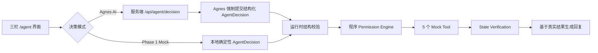

# 智能座舱 Personal Agent

一个用 **Memory（用户记忆）× Vehicle Context（车辆上下文）** 驱动车载智能决策的三栏交互 Demo。项目重点不是让大模型直接控制车辆，而是验证一条可解释、可授权、可执行、可验证的 Agent 产品闭环。

> 当前状态：Phase 1 闭环、Agnes 结构化决策接入、Memory 生命周期、异常工具结果和 15 条确定性 Eval 已实现。所有车辆、导航、补能站和餐厅能力仍为 Mock（模拟）实现。

## 在线链接

- GitHub 仓库：[JBX123159/personal-agent](https://github.com/JBX123159/personal-agent)
- 在线演示（Vercel Preview）：[打开 Personal Agent](https://personal-agent-k5jfyix81-jbx1.vercel.app)

在线演示默认使用 Agnes AI，也可切换到 `Phase 1 Mock` 稳定演示 Scenario 01 / 02 / 03。

## 项目解决什么问题

普通车载语音助手通常只处理一次性指令，难以同时回答三个问题：

- 当前车辆和乘员状态是否适合执行？
- 哪些历史偏好经过用户确认，可以安全复用？
- 工具返回成功后，车辆状态是否真的符合预期？

本项目的核心假设是：**把实时 Context 与用户确认过的 Memory 组合成 Goal 和 Plan，再由程序完成权限裁决与结果验证，可以让个性化体验和执行安全同时成立。**

## 系统闭环

```text
User Input
  → Context
  → Memory
  → Goal
  → Plan
  → Permission
  → Tool
  → Verification
  → Response
```



Agnes 只负责提出结构化决策。模型必须调用虚拟函数 `submit_agent_decision`，但该函数本身不执行任何工具。通过结构校验后，程序的 Permission Engine（权限引擎）仍会独立决定允许、拒绝或等待确认，最终回复以 Tool Result 和 Verification Result 为事实来源。

## 已实现能力

- Next.js、TypeScript、Tailwind CSS、shadcn/ui 三栏 Agent Demo。
- 可手动调整的 Vehicle Context，以及 Context 快照展示。
- 5 个可控 Mock Tool：
  - `getVehicleState`
  - `setClimateTemperature`
  - `setNavigation`
  - `searchEnergyStation`
  - `searchRestaurant`
- 每个工具可切换 `SUCCESS`、`FAILED`、`TIMEOUT`。
- Agnes `agnes-2.5-flash` 真实服务端调用路径。
- 强制函数调用形式的 Structured Output（结构化输出）与运行时参数校验。
- 程序权限裁决覆盖 LLM 提议，LLM 无法绕过授权和确认。
- Memory 从观察、Candidate、Active 到 Pause、Resume、Forget 的生命周期。
- State Verification：工具自报成功但状态不一致时，禁止宣称成功。
- FAILED、TIMEOUT、Partial Success（部分成功）的如实回复。
- 15 条不依赖外部 LLM 的确定性 Eval，以及 JSON 结果文件。

## 明确未实现

以下内容不在当前阶段范围内：

- 真实汽车控制、地图导航、餐厅或补能站接口。
- 数据库、登录、多用户和跨设备同步。
- 云端或跨会话 Memory；刷新页面后 Mock Memory 会重置。
- RAG（检索增强生成）、Vector DB（向量数据库）、MCP、Multi-Agent。
- 线上部署、线上用户量、性能或商业指标。

## 本地运行

### 环境要求

- Node.js 20 或更高版本
- npm
- 如需验证真实 Agnes 模式：有效的 Agnes API Key 和可访问 Agnes 服务的网络

### 安装与启动

```powershell
cd personal-agent
npm install
Copy-Item .env.example .env.local
```

打开 `.env.local`，在 `AGNES_API_KEY` 后填写你自己的 Agnes API Key。不要把密钥粘贴到 README、终端日志或提交到 Git。

然后启动开发服务器：

```powershell
npm run dev
```

浏览器访问：<http://localhost:3000/agent>

页面默认选择 `Agnes AI`。如果尚未配置 API Key，可以切换到 `Phase 1 Mock`，完整演示三个固定场景。`.env.local` 已被 `.gitignore` 排除，API Key 只由服务端 Route Handler 读取，不会发送到浏览器代码。

## Scenario 演示

开始每个场景前，建议点击页面的重置按钮，并切换到 `Phase 1 Mock`，这样演示结果不受网络和模型波动影响。

### Scenario 01：今晚还是老样子吧

1. 保持默认 Context：周五 17:40、位置 Office、电量 19%、仅车主、舱温 31℃。
2. 在 Tools 面板确认 5 个 Tool 均为 `SUCCESS`。
3. 输入 `今晚还是老样子吧` 并发送。
4. 在 Inspector 查看 Context、引用的 Active Memory、Goal、Plan 和 Permission。
5. 导航属于高影响操作，此时应显示等待用户确认，写操作尚未执行。
6. 点击“确认并执行方案”。
7. 预期：完成车辆状态读取、补能站与餐厅查询、导航和空调设置；Verification 通过后才显示完成回复。

### Scenario 02：Memory Candidate → Active → Pause / Forget

1. 连续发送 3 次 `空调24℃就行`。
2. 前两次只累计观察；第 3 次后 Memory 面板出现 `candidate`，观察次数为 3。
3. Candidate 未确认时不会授权空调写操作。点击“确认偏好”后，状态变为 `active`。
4. 再次发送同一句话，Active Memory 被引用，24℃ 空调操作可执行。
5. 点击“暂停”后，Memory 变为 `suspended`，不再参与决策；点击“恢复”可重新启用。
6. 点击“忘记”后，Memory 变为 `deleted`，从默认列表消失且不再传给 Agnes 或用于权限授权。

### Scenario 03：FAILED、TIMEOUT 与 Partial Success

输入固定为 `回家，把空调调到24℃`，导航需要点击确认后执行。

第一次演示：

1. 将 `setNavigation` 设为 `SUCCESS`。
2. 将 `setClimateTemperature` 设为 `FAILED`。
3. 发送指令并确认执行。
4. 预期回复：导航已完成，空调设置失败，整体为部分成功。

第二次演示：

1. 重置后将 `setNavigation` 设为 `SUCCESS`。
2. 将 `setClimateTemperature` 设为 `TIMEOUT`。
3. 发送指令并确认执行。
4. 预期回复：导航已完成，空调结果未知；系统不会把超时表述为成功。

## Eval

运行全部 15 条确定性评测：

```powershell
npm run eval
```

评测用例分为：

| 分类 | 数量 | 主要验证内容 |
| --- | ---: | --- |
| Normal | 3 | 常规例程、车辆状态读取、已确认空调偏好 |
| Ambiguous | 2 | Context 不匹配与未知指令澄清 |
| Memory | 3 | Candidate、Active、Suspended 是否正确参与决策 |
| Tool | 3 | FAILED、TIMEOUT、Partial Success |
| Permission | 2 | 导航等待确认、无授权空调被拒绝 |
| Verification | 2 | 空调或导航的预期状态不一致 |

当前已提交结果位于 [`eval/results/latest.json`](eval/results/latest.json)：

| 指标 | 实际结果 |
| --- | ---: |
| Eval Case 通过数 | 15 / 15 |
| Intent Accuracy | 1.0000 |
| Memory Accuracy | 1.0000 |
| Task Completion Rate | 1.0000 |
| Tool Success Rate | 0.7059（12 / 17） |
| False Success Rate | 0.0000 |
| Unauthorized Action Count | 0 |

`Tool Success Rate = 0.7059` 是因为 Eval **故意加入了工具失败、超时和状态验证不一致的 Case**。这些用例用于确认系统会如实报告异常，并不表示系统发生越权；未授权动作数仍为 0。这里的 `15 / 15` 表示每个 Case 都符合其预期行为，包括“应被拒绝”“应等待确认”和“应报告失败”的负向用例。

默认 Eval 使用本地确定性 Decision，不调用 Agnes，也不使用 LLM 评分，避免把网络、额度和模型波动混入程序边界测试。

## 关键产品规则

### Permission

- 读取类 Tool 可以直接执行。
- 低风险写操作必须有匹配当前 Context 的 Active、用户已确认 Memory，并且操作可撤销。
- 导航等高影响操作必须获得本轮用户明确确认。
- Agnes 的权限判断只是一项提议；程序输出的 `ALLOW`、`DENY`、`REQUIRE_CONFIRMATION` 才是最终裁决。
- 被拒绝或等待确认的 Tool 不会进入执行函数。

### Memory

- 相同的“空调 24℃”偏好观察 3 次后形成 Candidate。
- Candidate 必须由用户确认后才能成为 Active。
- Suspended 和 Deleted Memory 不参与决策，也不会传给 Agnes。
- 当前 Memory 仅保存在浏览器会话中，刷新页面会重置。

### Verification 与真实回复

- `SUCCESS` 后还要比较预期状态与观测状态。
- `FAILED` 明确报告失败；`TIMEOUT` 明确报告结果未知。
- Tool 返回成功但状态不一致时，禁止声明完成。
- 多个 Tool 结果不一致时逐项说明，生成 Partial Success 回复。
- 最终回复由程序依据执行与验证结果组合，不使用 LLM 的执行前草稿冒充结果。

## 技术取舍与限制

- 使用原生 `fetch` 接入 Agnes，减少额外 SDK 依赖。
- 使用强制 `submit_agent_decision` 函数调用承载结构化输出，再由本地 Schema 校验；不依赖自由文本 JSON。
- Mock Tool 保证失败、超时和验证不一致可以稳定复现，但不能代表真实车辆接口表现。
- Memory 仅为前端会话状态，适合验证产品规则，不具备持久化能力。
- 真实 Agnes 请求受网络、API 额度和上游服务状态影响；请求失败或结构校验失败时不会执行 Tool，用户可手动重试。
- 2026-08-09 已使用本地 `.env.local` 完成真实 Agnes Scenario 01 在线 smoke：页面显示 `Decision Source：Agnes AI`，结构化决策通过校验；即使模型标记无需确认，程序仍将导航覆盖为 `HIGH + REQUIRE_CONFIRMATION`；用户确认后 4 个 Tool 均为 `SUCCESS`、状态验证通过且 `Case：PASS`。在线验收期间也观察到上游偶发超时，错误回合均未执行 Tool。`.env.local` 与 API Key 始终保持未跟踪状态。

## 项目目录

```text
.
├─ src/
│  ├─ app/
│  │  ├─ agent/                 # 三栏 Demo 页面
│  │  └─ api/agent/decision/    # Agnes 服务端 Route Handler
│  ├─ components/agent/         # Chat、Context、Inspector UI
│  ├─ data/                     # Mock Context、Memory、Tool 状态
│  ├─ domain/                   # Agent 与 Structured Decision 类型
│  └─ lib/                      # Schema、Agnes、Permission、Tool、Verification、Memory、Pipeline
├─ eval/
│  ├─ cases.ts                  # 15 条固定 Eval Case
│  ├─ run-eval.ts               # 确定性 Eval Runner
│  └─ results/latest.json       # 最新实际结果
├─ docs/superpowers/            # 已确认的设计与实施计划
├─ .env.example                 # 仅包含环境变量占位符
└─ README.md
```

## 常用检查命令

```powershell
npm run typecheck
npm run lint
npm test
npm run eval
npm run build
```

## Agnes 参考资料

- [Agnes AI 官方文档总览](https://agnes-ai.com/en/docs/overview)
- [Agnes 2.5 Flash 官方文档](https://agnes-ai.com/en/docs/agnes-25-flash)
- [AgnesAI-Models 官方 GitHub 仓库](https://github.com/AgnesAI-Labs/AgnesAI-Models)
